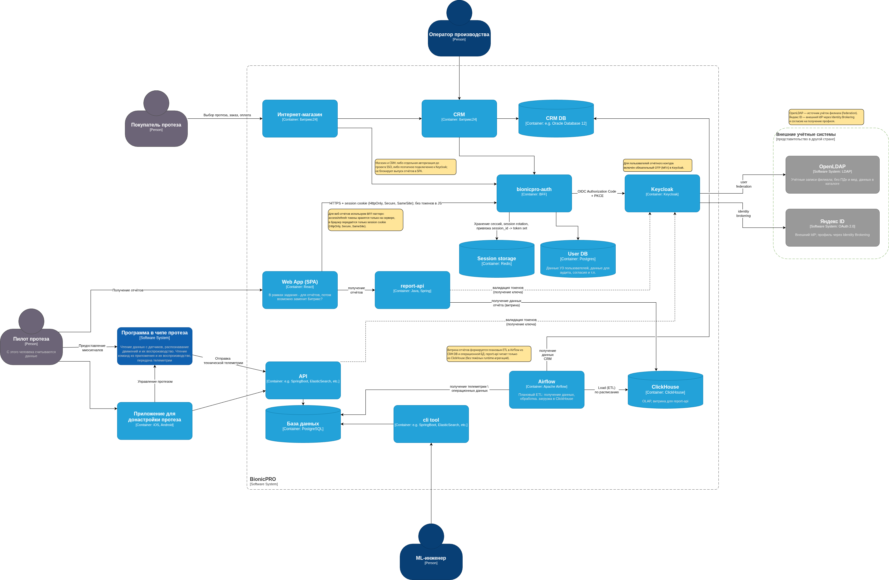
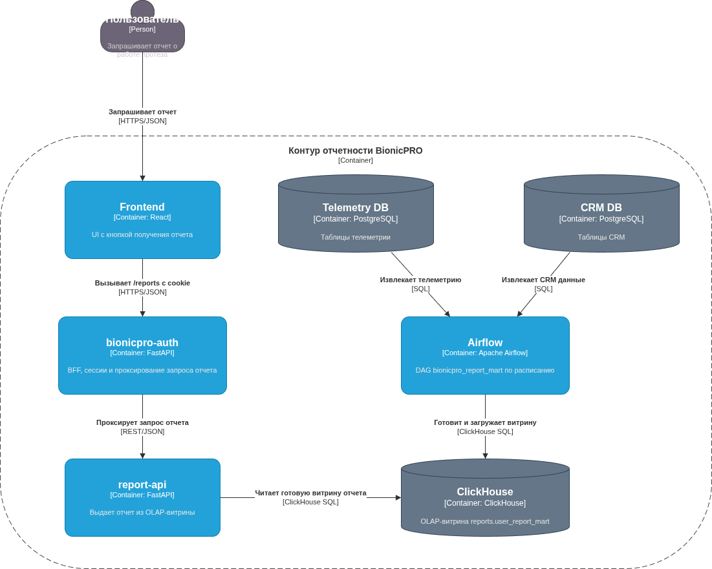
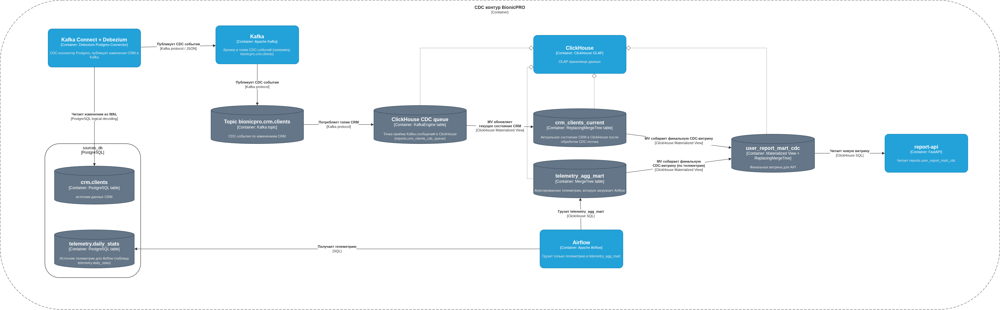

# BionicPRO: архитектура и реализация

Проект реализует единый защищённый контур доступа к отчётам пользователей протезов: аутентификация через Keycloak и BFF, подготовка отчётных витрин, кэширование отчётов в S3/CDN и CDC-поток CRM.

## Статус выполнения

- Выполнено: **Task1, Task2, Task3, Task4**
- Каждое следующее задание расширяет архитектуру предыдущего.

## Кратко о проекте

- `frontend` работает только через `bionicpro-auth` cookie-сессию (без токенов IdP в браузере).
- `bionicpro-auth` реализует PKCE, хранение сессии, refresh токена и проксирование `/reports`.
- `report-api` читает отчётные данные из ClickHouse и использует cache-aside в MinIO.
- `cdn` (Nginx) раздаёт отчёты из MinIO с `proxy_cache`; внешняя ссылка для фронта проходит через BFF (`/reports-cache/*`) для сохранения защищённого контура.
- `Airflow` обновляет витрины по расписанию; CRM-изменения доставляются через Debezium/Kafka/ClickHouse MV.
- Для совместимости с Windows данные ClickHouse хранятся в Docker named volume (без bind mount в `/var/lib/clickhouse`).

## Подробности по заданиям

| Задание | Статус | Что реализовано | Подробности |
|---|---|---|---|
| Task1 | ✅ | Безопасная аутентификация, BFF, LDAP, MFA, Яндекс ID | [`Task1/README.md`](./Task1/README.md) |
| Task2 | ✅ | Сервис отчётов и витрина данных (OLAP + Airflow) | [`Task2/README.md`](./Task2/README.md) |
| Task3 | ✅ | S3/MinIO + CDN (Nginx) для снижения нагрузки на OLAP | [`Task3/README.md`](./Task3/README.md) |
| Task4 | ✅ | CDC CRM через Debezium/Kafka и витрина `user_report_mart_cdc` | [`Task4/README.md`](./Task4/README.md) |

## Схемы по заданиям

### Task1



### Task2



### Task3


### Task4



## Быстрый запуск

```bash
make up
```

Чистый старт (сброс локальных томов данных, как после `git clone`): `make up-clean`.

### Запуск без make

Если `make` не установлен (частый случай на Windows), используйте эквивалентные команды:

```bash
# Аналог make up
mkdir -p airflow/logs
docker compose up -d --build

# Аналог make up-clean (полный чистый старт)
docker compose down -v
docker run --rm -v "${PWD}:/workspace" alpine:3.20 sh -c 'rm -rf /workspace/postgres-keycloak-data /workspace/postgres-app-data /workspace/postgres-sources-data /workspace/postgres-airflow-data /workspace/clickhouse-data /workspace/minio-data /workspace/airflow/logs /workspace/airflow/dags/__pycache__'
mkdir -p airflow/logs
docker compose up -d --build

# Аналог make down
docker compose down
```

Полный сброс окружения и Docker-кэшей на машине:

```bash
make clean-full
```

Команда `make clean-full` удаляет все Docker-контейнеры, неиспользуемые сети/тома, build cache и локальные папки данных проекта (образы не удаляются).

Если нужно удалить и образы тоже:

```bash
make clean-docker-purge
```

## Быстрая проверка

```bash
make smoke
```
`make smoke` — это единая системная проверка (health + CDC + функциональная проверка отчётов и CDN cache).
Для обратной совместимости доступен синоним: `make smoke-system`.

Без `make`:

```bash
# Аналог make smoke / make smoke-system (кроссплатформенный Python smoke)
python3 ./scripts/system_smoke.py
```

## Операционные проверки

- Яндекс IdP: после `make up` выполнить `python3 scripts/configure_yandex_idp.py`, затем проверить вход через Яндекс в UI.


