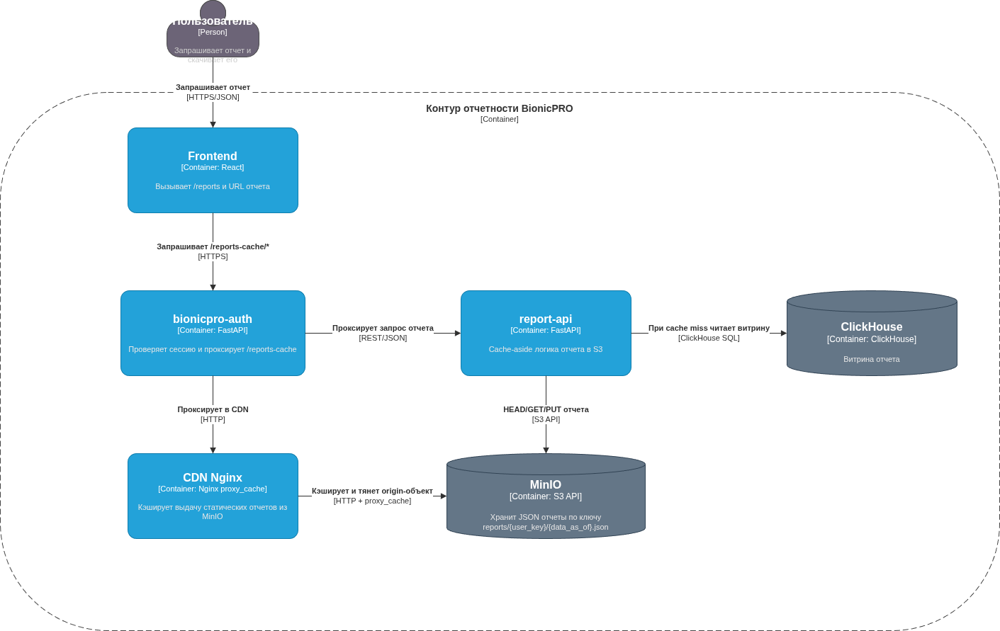

# Task3: S3, CDN и снижение нагрузки на OLAP

Текущая реализация отражает срез Task3; в следующих заданиях архитектура расширяется и эволюционирует (CDC-контур и новая витрина в ClickHouse).

## Что сделано

- В `report-api` реализована cache-aside логика отчётов: сначала проверка объекта в S3, при отсутствии — чтение из OLAP, запись в S3 и возврат ссылки на CDN.
- Настроено объектное хранилище MinIO (S3 API) и автоматическая подготовка бакета `bionicpro-reports`.
- Поднят CDN-слой на Nginx как reverse proxy к MinIO с `proxy_cache` и заголовком `X-Cache-Status`.
- Определена структура ключей хранения отчётов в S3: `reports/{user_key}/{data_as_of}.json`.
- Для обновления кэша используется версионирование ключа по `data_as_of`: после нового ETL создаётся новый объект и новый URL.
- Доступ к отчётам остаётся в защищённом контуре через BFF (`bionicpro-auth`) с проксированием `/reports-cache/*`.

## Где лежит

- Диаграмма (draw.io): [`Task3_s3_cdn_architecture.drawio.xml`](./Task3_s3_cdn_architecture.drawio.xml)
- Диаграмма (PNG): [`diagram.png`](./diagram.png)
- API отчётов (S3 + CDN URL): [`../report-api/app/main.py`](../report-api/app/main.py)
- BFF-прокси CDN-URL: [`../bionicpro-auth/app/main.py`](../bionicpro-auth/app/main.py)
- Конфигурация CDN Nginx: [`../cdn/nginx.conf`](../cdn/nginx.conf)
- Инфраструктура MinIO/CDN: [`../docker-compose.yaml`](../docker-compose.yaml)

## Диаграмма

## Почему CDN проксируется через BFF

В текущей реализации ссылка на отчёт возвращается в виде `http://localhost:8000/reports-cache/...`, то есть через `bionicpro-auth`, а не напрямую на `:8090`. Это сделано осознанно:

- сохраняется единый защищённый периметр (cookie-сессия BFF, без прямого публичного доступа клиента к внутренней сети сервисов);
- снимаются проблемы браузера с CORS/Private Network Access при запросах между разными origin/портами;
- доступ к файлу отчёта остаётся авторизованным и привязанным к действующей сессии пользователя.

Важно: `X-Cache-Status` относится к Nginx CDN (`cdn`) и отражает попадание в его `proxy_cache`; поле `delivery: s3_cache_hit` в JSON — это отдельный слой, попадание в объект в S3 (MinIO) и отсутствие повторного «тяжёлого» чтения из OLAP.
